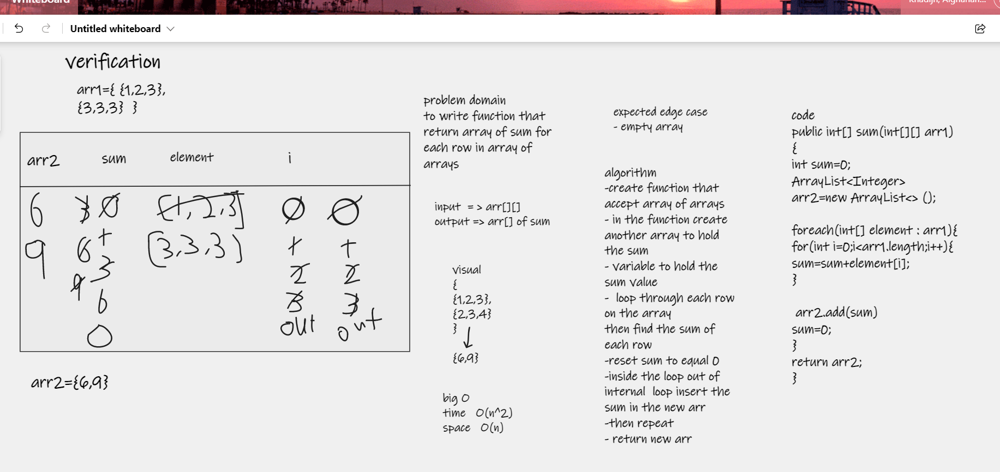

# Mock Interviews

in this challenge we worked with partners and one of us act like interviewer the other will act like candidate then  the rules will change .

## Algorithm for interview Q

## Approach & Efficiency 
in this Approach for the time complexity O(n^2) because it will iterate through loop inside other loop
for space complexity O(n) the size of the array .

#### Rubric form

 [Rubric form](https://docs.google.com/spreadsheets/d/1EF1pJzRL8GUooUesBcsAUP9Mjb3jiCcLT4BzBJIgOWs/edit?usp=sharing)