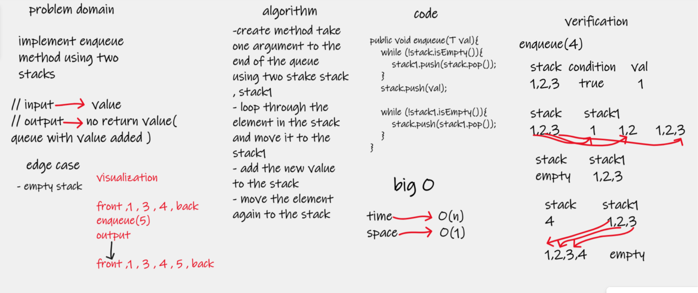
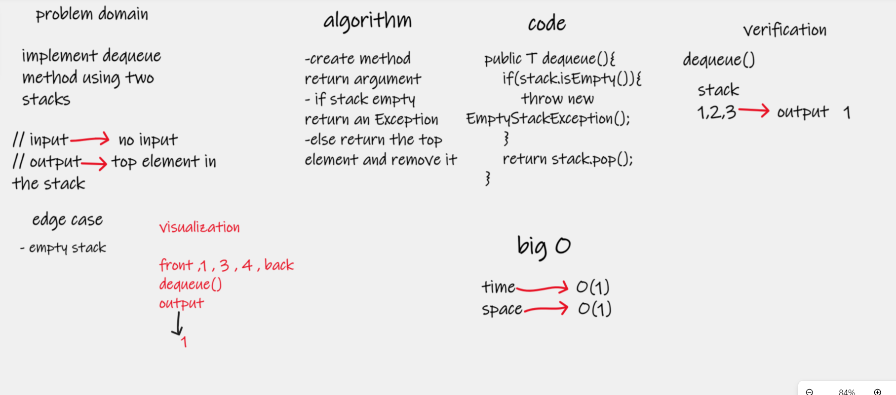

# Stacks and Queues
**Stack**

is a linear data structure which follows a particular order in which the operations are performed. The order may be LIFO(Last In First Out) or FILO(First In Last Out).

**Queue**

A Queue is a linear structure which follows a particular order in which the operations are performed. The order is First In First Out (FIFO). A good example of a queue is any queue of consumers for a resource where the consumer that came first is served first

**PseudoQueue**

class to implement queue using two stack 

## Challenge
this challenge about implement our queue and stack data structure 

## Whiteboard Process

## Approach & Efficiency
the code about implement stake and queue methode , and considered the best big O 
for the method 

 **stack methode**

| method  | time complexity | space complexity |
|---------|-----------------|------------------|
| push    | O(1)            | O(1)             |
| pop     | O(1)            | O(1)             |
| peek    | O(1)            | O(1)             |
| isEmpty | O(1)            | O(1)             |

**queue method**

| method  | time complexity | space complexity |
|---------|-----------------|------------------|
| enqueue | O(1)            | O(1)             |
| dequeue | O(1)            | O(1)             |
| peek    | O(1)            | O(1)             |
| isEmpty | O(1)            | O(1)             |

**PseudoQueue method**

| method  | time complexity | space complexity |
|---------|-----------------|------------------|
| enqueue | O(n)            | O(1)             |
| dequeue | O(1)            | O(1)             |

## API
**stake methode**

push => methode take one argument and add it to the top of the stake 

pop => method remove the top element in the stack and return its value.

peek => method return the top element in the stack without remove it 

isEmpty => method to check if stack is empty or not return boolean

**queue methode**

enqueue => method tack one argument and add it in the end of the queue

dequeue => method remove the first element in the queue and return its value

peek => method return the first element in the queue without remove it

isEmpty => method to check if queue is empty or not return boolean

**PseudoQueue**

enqueue => method tack one argument and add it in the end of the queue it used two stacks 
and loop through it, so it takes O(n) for time  

dequeue => method remove the first element in the queue and return its value
