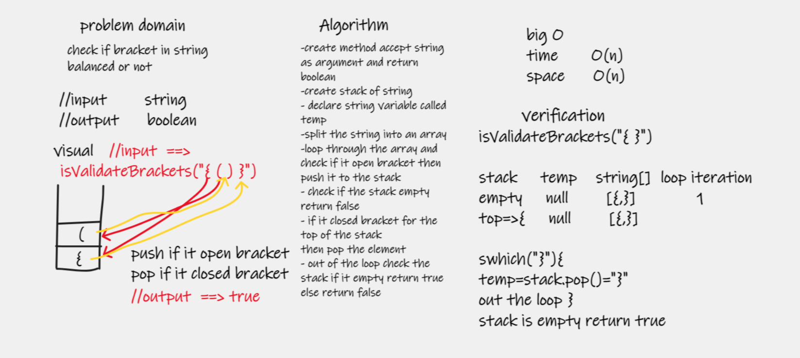
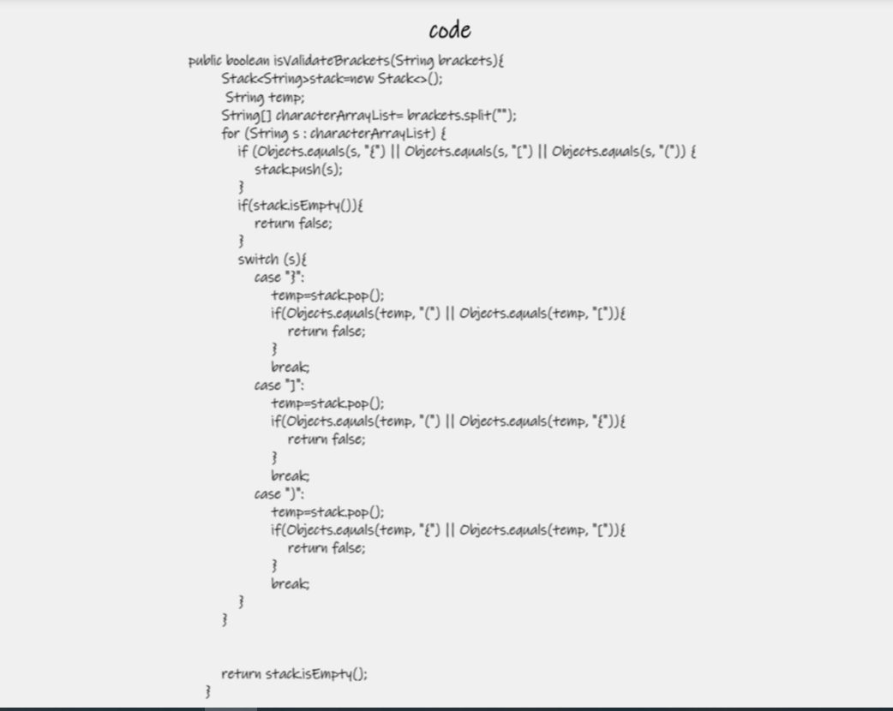

# Challenge Summary
function to check the balance of bracket using stack 

{()} => true

{[}=> false

## Whiteboard Process

## Approach & Efficiency
| method             | time complexity | space complexity |
|--------------------|-----------------|------------------|
| isValidateBrackets | O(n)            | O(n)             |

## Solution
isValidateBrackets() => method take string as argument and check if bracket in the string are balanced or not , return true or false 

got littel helped by [geeksforgeeks](https://www.geeksforgeeks.org/java-program-to-check-for-balanced-brackets-in-an-expression-well-formedness-using-stack/)