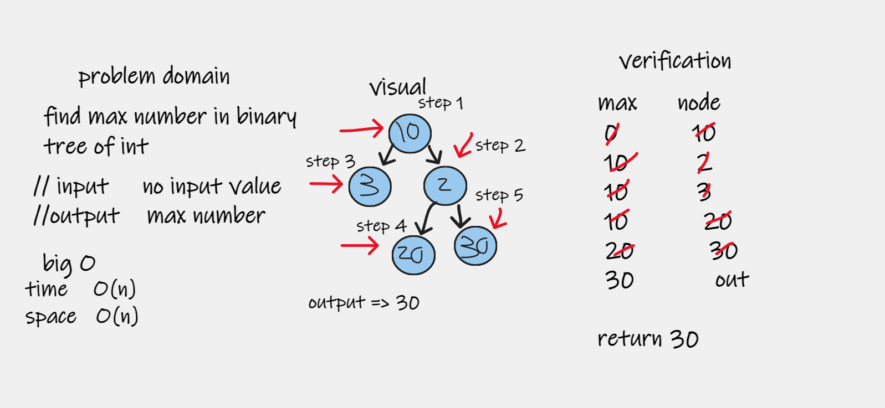
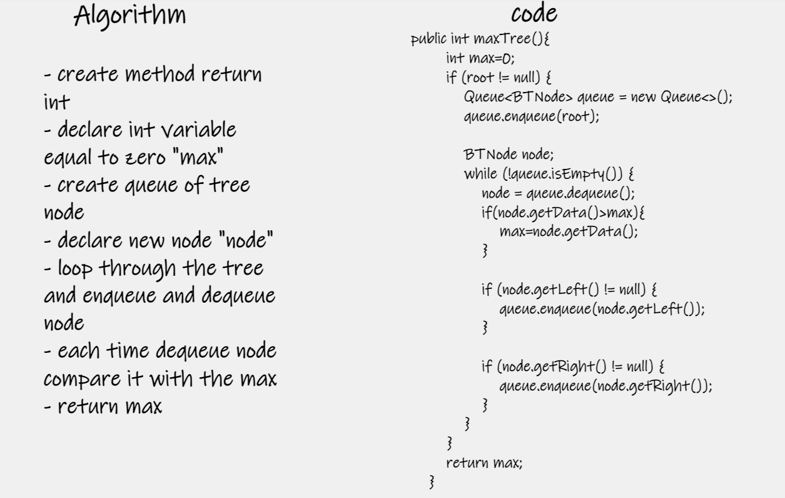
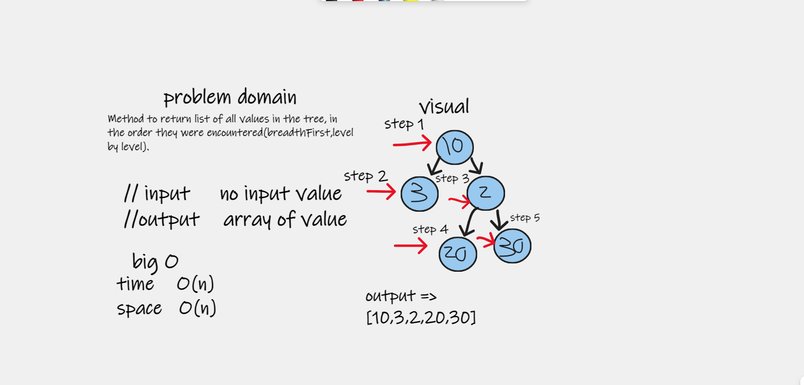
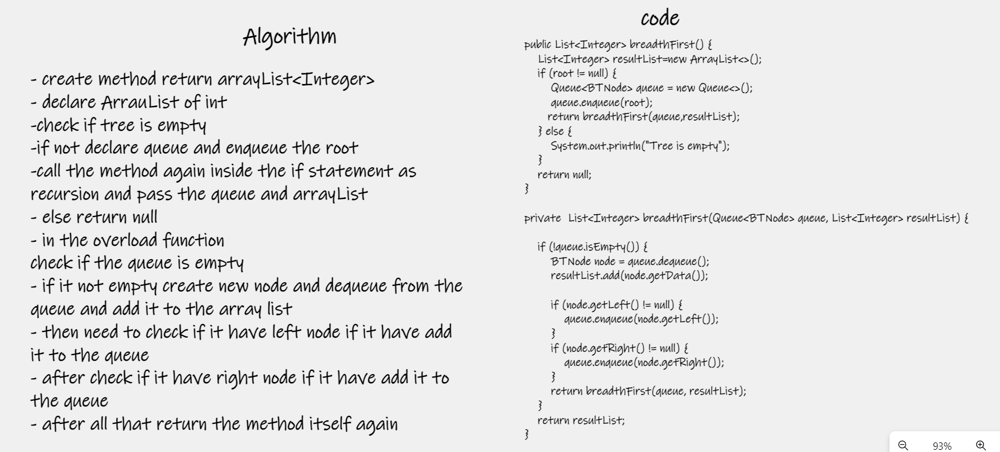

# Trees
non-linear data structure defined as a collection of nodes, where each node is a data structure consisting of a value and a list of references to nodes. The start of the tree is the "root node" and the reference nodes are the "children"

## Challenge
implement binary tree and binary search tree 

## Approach & Efficiency

**binary tree**

| method    | time complexity | space complexity |
|-----------|-----------------|------------------|
| preorder  | o(n)            | O(n)             |
| postorder | O(n)            | O(n)             |
| inorder   | O(n)            | O(n)             |

**binary search tree**

| method  | time complexity | space complexity |
|---------|-----------------|------------------|
| insert  | o(n)            | O(n)             |
| search  | O(log n)        | O(n)             |

## API
preorder => function use stack to travers through the tree in "root->left->right" approach

postorder => function use stack to travers through the tree in "left->right->root" approach

inorder => function use stack to travers through the tree in "left->root->right" approach

insert => insert to array using recursion way

search => function return boolean and tack element to search about using recursion way 

# challenge 16

# Challenge Summary
 find maximum numeric value in binary tree of int 

## Whiteboard Process

## Approach & Efficiency
| method  | time complexity | space complexity |
|---------|-----------------|------------------|
| maxTree | o(n)            | O(n)             |

## Solution
maxTree => method travers through binary tree level by level to find maximum value in tree of int 

# challenge 17

# Challenge Summary

Method to return list of all values in the tree, in the order they were encountered(breadthFirst,level by level).

## Whiteboard Process

## Approach & Efficiency
| method       | time complexity | space complexity |
|--------------|-----------------|------------------|
| breadthFirst | o(n)            | O(n)             |

## Solution
breadthFirst => method travers through binary tree level by level using recursion 