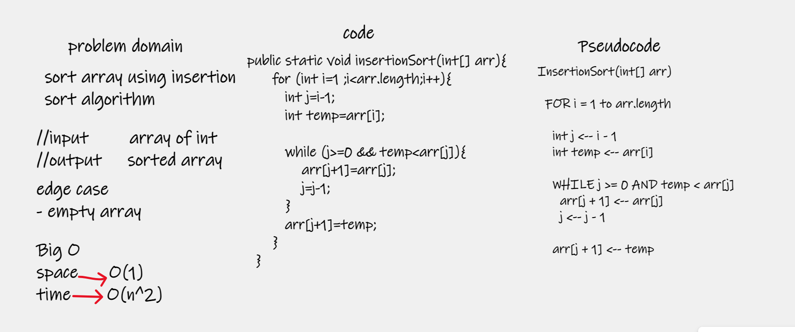
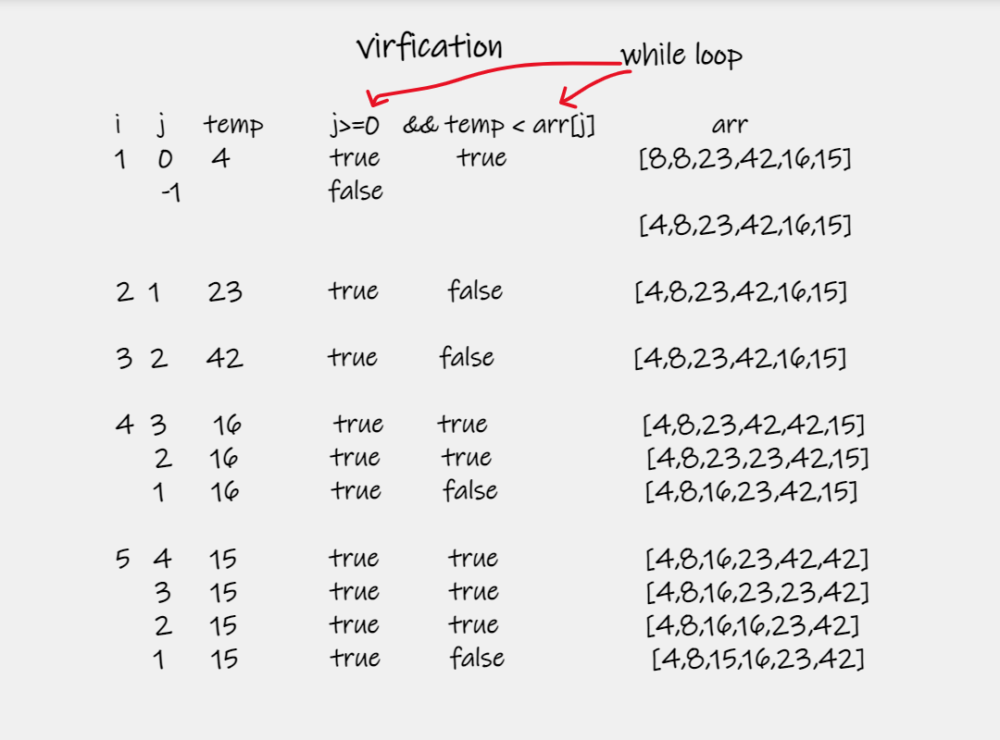
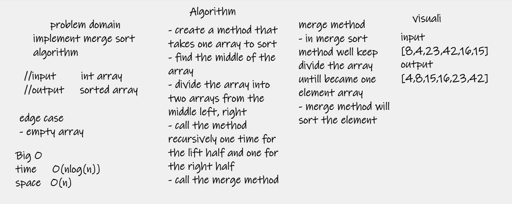
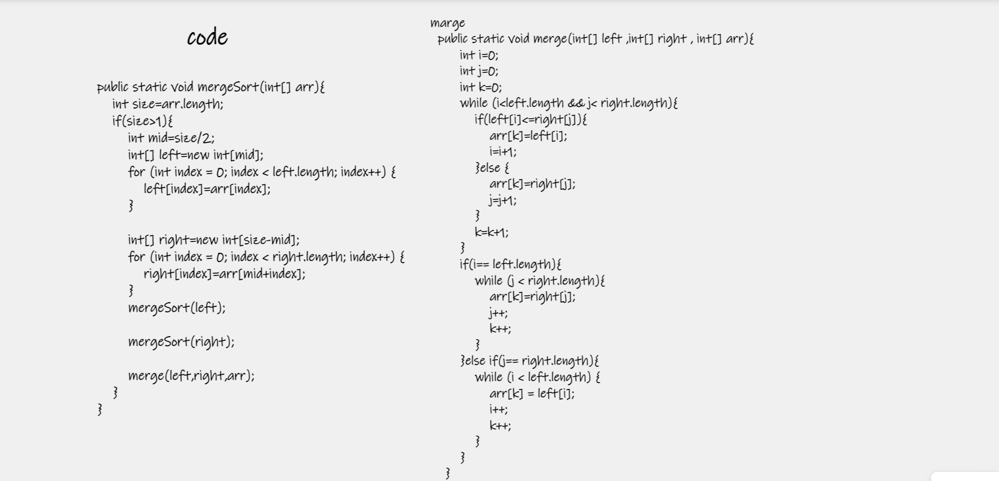
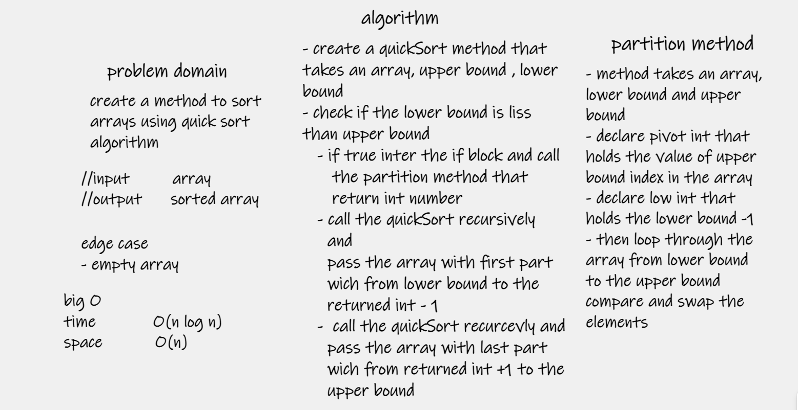
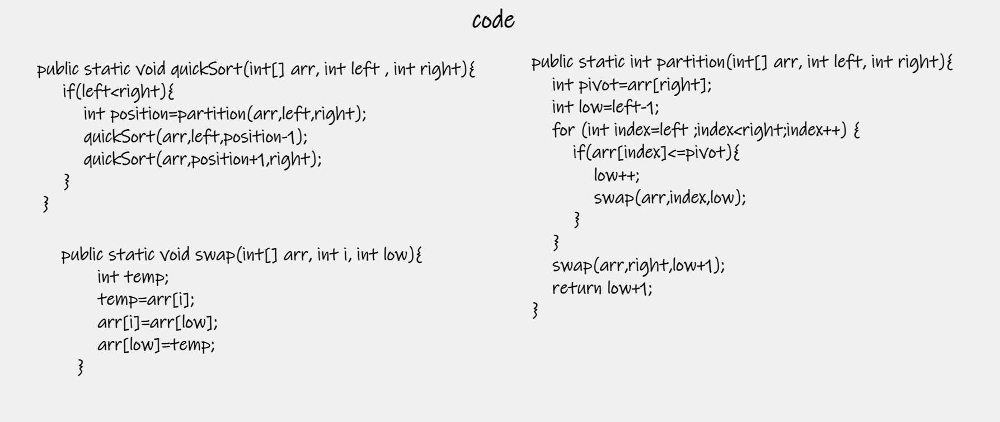

# Challenge 26
##  Challenge Summary

implement function for insertionSort algorithm  

## Whiteboard Process

## Approach & Efficiency

| method         | time complexity | space complexity |
|----------------|-----------------|------------------|
| insertion sort | O(n^2)          | O(1)             |

## Solution
insertionSort(int[] arr)  => method take array and sort it 
#
#

# Challenge 27
##  Challenge Summary

implement function for margeSort algorithm

## Whiteboard Process

## Approach & Efficiency

| method     | time complexity | space complexity |
|------------|-----------------|------------------|
| marge sort | O(nlogn)        | O(n)             |

## Solution
insertionSort(int[] arr)  => method take array and sort it using recursion 
marge(int[] lift,int[] right,int[] arr) => method called in marge sort method recursively 

#
#

# Challenge 28
##  Challenge Summary

implement function for quickSort algorithm

## Whiteboard Process

## Approach & Efficiency

| method     | time complexity | space complexity |
|------------|-----------------|------------------|
| quick sort | O(nlogn)        | O(1)             |

## Solution
quickSort(int[] arr, int left , int right)  => method take array and sort it using recursion
partition(int[] arr, int left, int right) => method called in quickSort method recursively 
