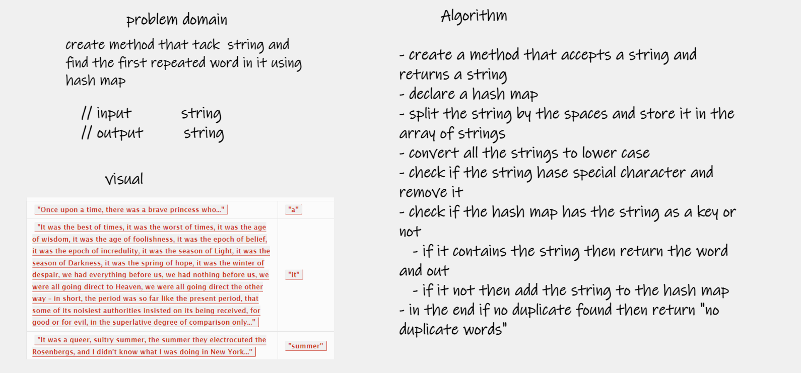
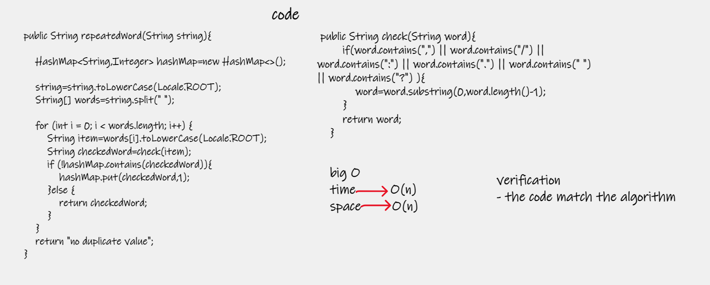
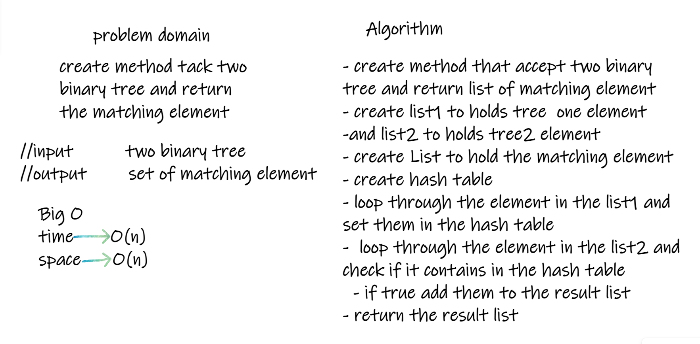
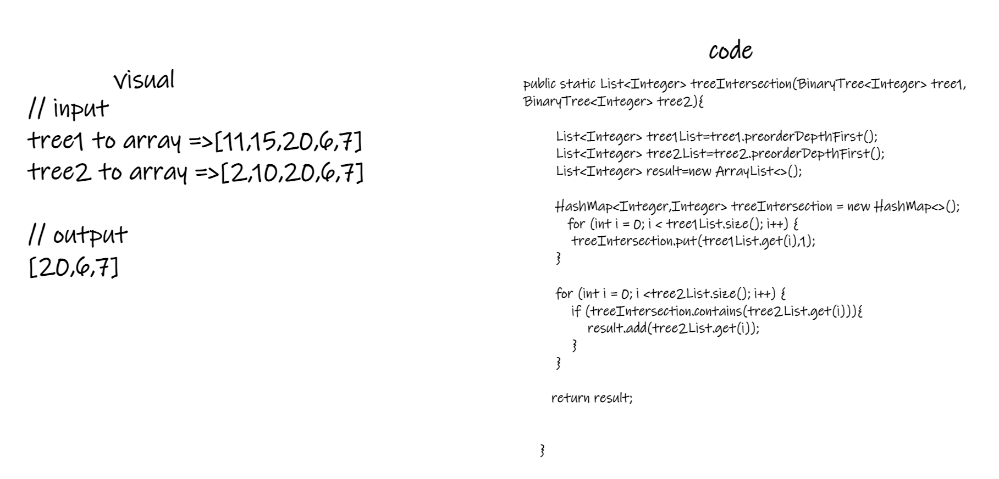

# Hashtable
hash table is data structure to store key-value pairs , the index of the key identified using hashing function 

## Challenge
this challenge about implement hash table data structure

## Approach & Efficiency

| method           | time complexity | spase complexity |
|------------------|-----------------|------------------|
| getBucketIndex() | O(1)            | O(1)             |
| put()            | O(n)            | O(n)             |
| contains()       | O(n)            | O(1)             |
| keys()           | O(n)            | O(n)             |
| get()            | O(n)            | O(1)             |

## API

- getBucketIndex() => method take a key and return it hashed and converted to an int index to put it in the array
- put() => method take Key and value to save it in hashed index that returned from getBucketIndex() method
- contains () => method take key and return true if it in the table and false if isn't
- get() => method take key and return its value 
- keys() => method to return set of all keys in the hash table 

# challenge 31

## Challenge Summary
Write a function called repeated word that finds the first word to occur more than once in a string

## Whiteboard Process

## Approach & Efficiency

| method         | time complexity | spase complexity |
|----------------|-----------------|------------------|
| repeatedWord() | O(n)            | O(n)             |

## Solution
repeatedWord() => method tacks string and find the first repeated word in the given string then return it  
check() => helping method to check if the string have special character then return it  

# challenge 32

## Challenge Summary
Write a function called treeIntersection that tack two binary tree and return the matching element 

## Whiteboard Process

## Approach & Efficiency

| method             | time complexity | spase complexity |
|--------------------|-----------------|------------------|
| treeIntersection() | O(n)            | O(n)             |

## Solution
treeIntersection() => method tacks tow binary tree and find the matching element and return them as list   
