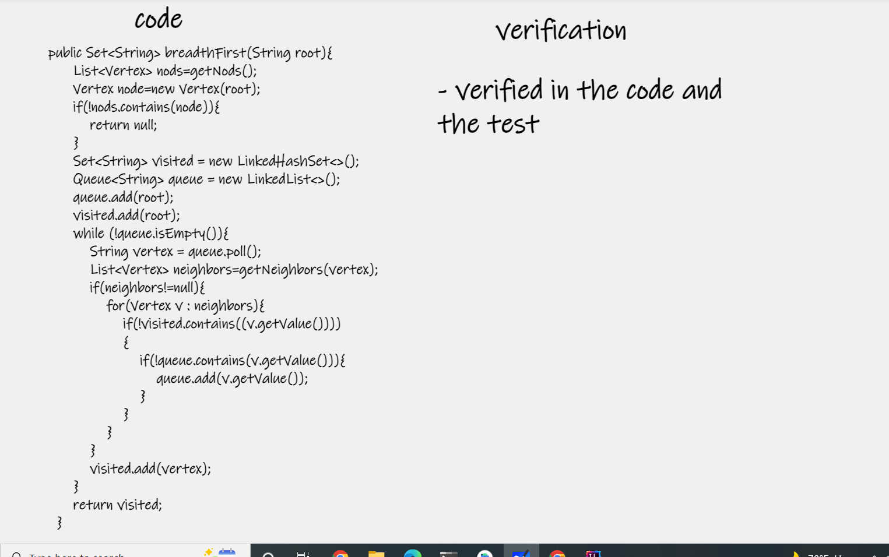

# Graphs
Graph is non-linear data structure consist of nodes called (vertex) and edges 

## Challenge
to implement my own graph data structure, and it's method 

## Approach & Efficiency

| method       | time complexity | space complexity |
|--------------|-----------------|------------------|
| addNode      | O(1)            | O(1)             |
| addEdge      | O(1)            | O(1)             |
| getNods      | O(n)            | O(n)             |
| size         | O(n)            | O(1)             |
| getNeighbors | O(1)            | O(1)             |

where (n) is number of elements in the graph  

## API
addNode() => method that tack value to add it to the graph 

addEdge() => method that tack two values to add edge between them (to add them in both list )

getNods() => method to return all nodes in the graph 

size() => method to return the size of the graph (number of all nodes in the graph)

getNeighbors() => method that tack the node as argument and return it's edge  

# challenge 36
write method to implement breadth first search on graph 

## Whiteboard Process

## Approach & Efficiency
- the method traverse through the graph element so the time complexity O(n)
- in the method new data structure used so the space complexity O(n)

## Solution
breadthFirst() => method accept one element as the root of the graph then traverse through the element in breadth first Approach 