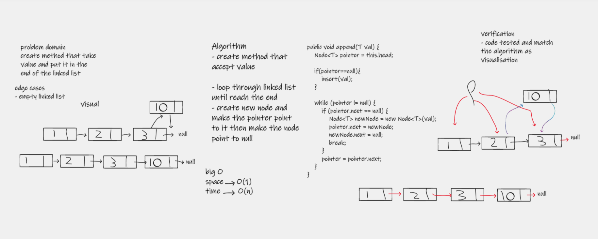
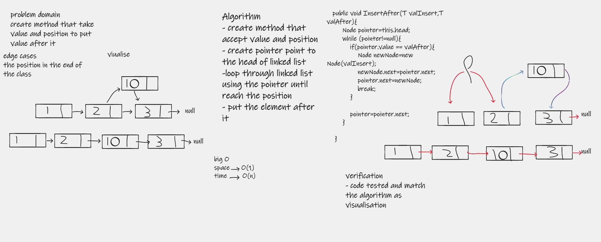

# Challenge Summary
this challenge about implement some of linked list method like insert before and insert after
and append 

## Whiteboard Process

## Approach & Efficiency
in this implementation some of methode take O(n) and Some take O(1) according to requirement

| method                             | time complexity | space complexity |
|------------------------------------|-----------------|------------------|
| append(val)                        | O(n)            | O(1)             |
| InsertAfter(valInsert,valBefore)   | O(n)            | O(1)             |
| InsertAfter( valInsert, valAfter)  | O(n)            | O(1)             |

## Solution
- append(val) take value and put it in the end of the linked list
- InsertAfter(valInsert,valBefore) take two values one for the value and one for the position to insert the value after it 
- InsertAfter( valInsert, valAfter) take two values one for the value and one for the position to insert the value before it 
