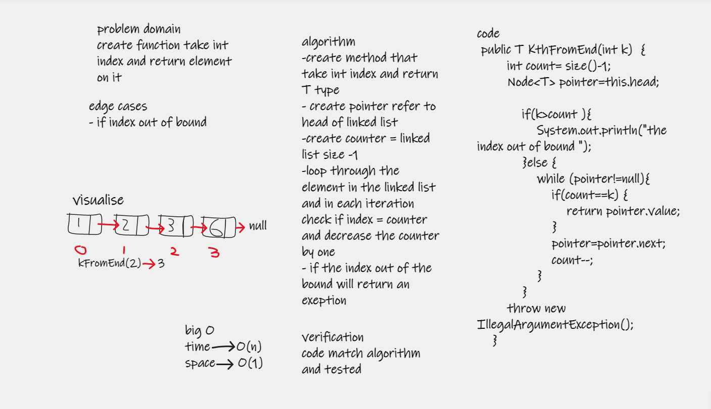

## Challenge Summary
this challenge about create method to get element from linked list tail using index
in single linked list

## Whiteboard Process

## Approach & Efficiency
KthFromEnd() method need to loop through whole the linked list to find the index, so it takes O(n)for time 

but according to space it take the linked list as it then loop through it so extra space needed it takes O(1)

| method       | time complexity | space complexity |
|--------------|-----------------|------------------|
| KthFromEnd() | O(n)            | O(1)             |

## Solution

KthFromEnd() it tacks int index to return the element on that index 