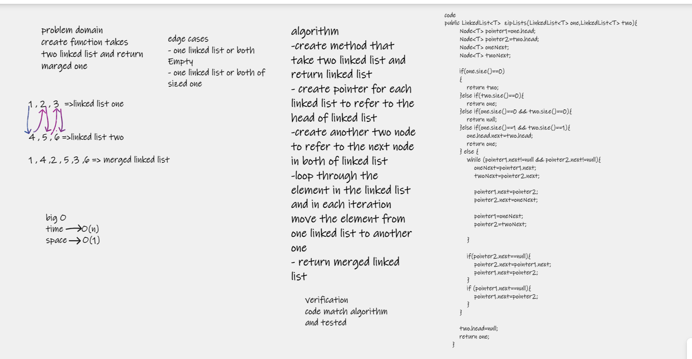

# Challenge Summary

this challenge about writing method takes two linked list and marge them in one linked list without additional space 

## Whiteboard Process

## Approach & Efficiency
the code marge two linked list in one list by moving one linked list to another without creating new linked list so the space complexity equals to O(1)

| method     | space complexity | time complexity |
|------------|------------------|-----------------|
| zipLists() | O(1)             | O(n)            |

## Solution
zipLists() => methode take two linked list and return one merged linked list without additional space 

